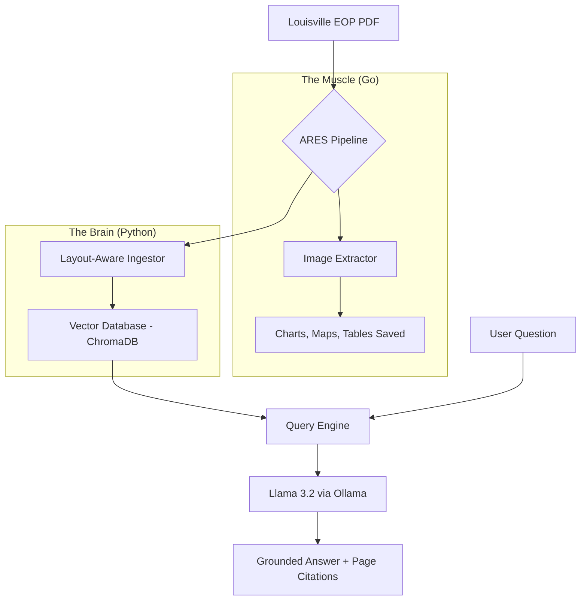

# ERES: Emergency Response & Evaluation System 🚀
**Bridging the Gap Between Static Plans and Actionable Intelligence**

## 📌 Project Overview
In Emergency Management, **Emergency Operations Plans (EOPs)** are critical but cumbersome. Often spanning hundreds of pages, these PDFs are difficult to navigate under the high-stress conditions of an active incident.

**ERES** is a local-first, high-performance RAG (Retrieval-Augmented Generation) pipeline designed to ingest complex EOPs and provide instant, grounded answers to field responders.

## 🏗 High-Level Architecture
ARES utilizes a unique **dual-engine architecture** to ensure that both text and visual data (maps, org charts) are preserved and utilized.

## ✨ Unique Features
Visual Preservation: Unlike standard AI tools that ignore images, the Go-based extractor ensures maps and ICS charts are archived for situational awareness.
Layout-Aware Ingest: Uses sophisticated partitioning to understand document hierarchy (headers, sub-sections, and tables).
Fully Local & Private: Designed for air-gapped or sensitive government environments; no data leaves the local machine.
Source Accountability: Every answer includes direct page citations from the original EOP to prevent AI hallucinations.

## 🛠 Tools & Techniques
Layer | Technology | Purpose
---|---|---|
Language (Infrastructure)|Go|High-speed PDF parsing and binary portability.
Language (AI)|Python 3.12|LangChain orchestration and data science libraries.
AI Model|Llama 3.2 (3B)|Local LLM served via Ollama for low-latency inference.
Vector DB|ChromaDB|High-performance embedding storage and retrieval.
Environment|WSL2 (Ubuntu)|Linux-standard development on Windows hardware.
DevOps|Docker|Containerization for reproducible deployments.

## 🚀 Future Roadmap: Cloud Scale
Currently transitioning the Go Extractor to AWS Lambda for event-driven processing. When a file is uploaded to an S3 Bucket, the system will automatically trigger the intelligence pipeline.

